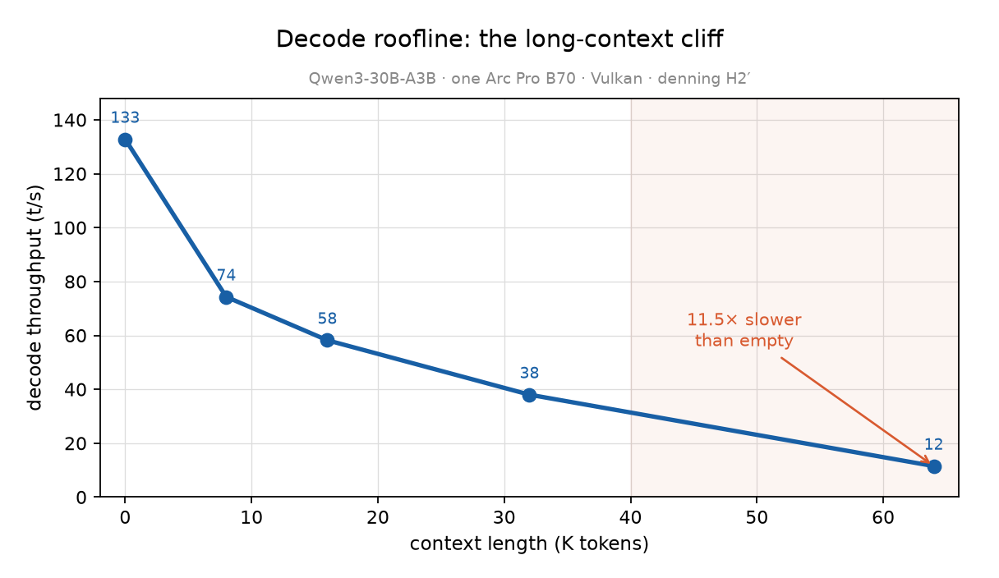
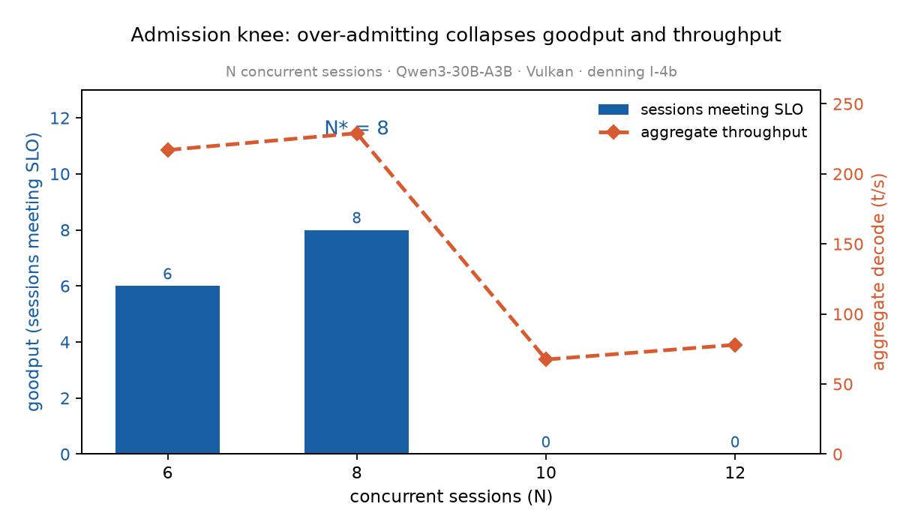
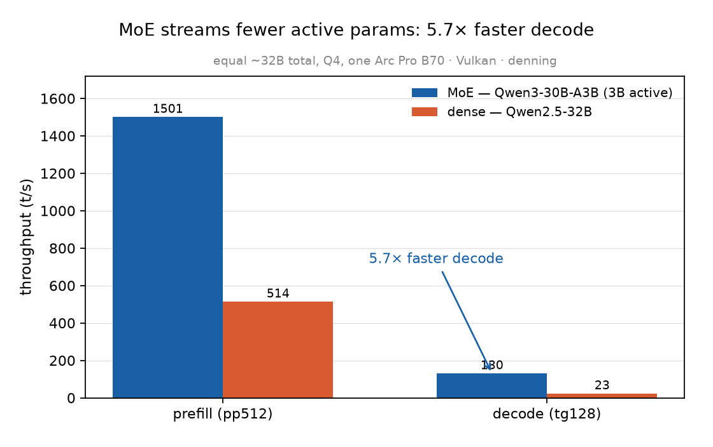

# denning

*Treating an LLM's context (KV-cache) and MoE experts as an OS-managed resource on fabric-less, OS-arbitrated GPUs.*

> **The headline result (H1, reproduced ×2).** On Windows + Intel Arc, once a co-tenant app pushes the GPU past its VRAM budget (~13 GB here), VidMm involuntarily evicts a model that *fits* — decode collapses **5×** while ~5 GB of it spills to PCIe-bounced shared memory. You can't pin against it ([here's why](results/defense-feasibility-d3d12-priority-20260619.md)); the fix is admission control on the live budget. The full, pre-registered story: [`results/E1-SUMMARY.md`](results/E1-SUMMARY.md).

**Named for Peter J. Denning** — the working-set model (CACM 1968) and the page-fault-frequency load-control tradition that followed (1970s). This project reincarnates that idea for KV/expert residency on a GPU: admit work to the resident set only while it fits the bandwidth roofline; suspend before you thrash.

## Thesis (one sentence)

On a fabric-less, RAM-inverted, OS-arbitrated GPU box (Windows/VidMm, PCIe-only Intel Arc, RAM < VRAM), correct LLM-state management is **bandwidth-roofline admission control + co-residency with an adversarial OS memory manager**, with reuse-provenance **lifetime classes** as the single control signal — demonstrated on the one workload the box is genuinely good at: **many concurrent agent KV sessions on a single card under desktop co-tenancy.**

**Contribution (one sentence):** *On memory-inverted, fabric-less GPUs the materialization decision inverts from the datacenter answer under compute contention, and closed-form admission control on this cost model — over a pinned deterministic arena, not heuristic paging — is sufficient to operate at the feasibility bound.* (North star above = motivation; this = the claim.)

**Goal: map the feasibility envelope (the bounds), with the simplest system that reveals it.** Compression depth and bit-checks are deferred levers — see `docs/cost-model.md` §7.

## Status: **G0 cleared (2026-06-19)** — forward predictions tagged; building toward H1

The cost-model core (R1–R3) and the admission roofline (H2′) are **already measured on-rig** ([`results/E1-SUMMARY.md`](results/E1-SUMMARY.md)) — run *ahead* of formal G0 but under the one rule: the predictions were git-committed (`1118d0c`) **before** the data (`2d19b09`+). G0 — the advisor-lens methodology pass, applied by the maintainer (the "advisor" is a viewpoint, not a third party) — is now cleared, and the still-**untested** forward predictions (**H1′, H4, H5′, H6**) are git-tagged **`prereg-launch-suppositions`** before their experiments run. Next: build the **I-1 VidMm-eviction watchdog**, then run **H1**.

## Results at a glance

  
  
  

  
  

*Top row — decode falls 11.5× by 64K context (the Vulkan attention cliff); goodput peaks at N\*=8 concurrent sessions (over-admission collapses goodput and throughput); the MoE decodes 5.7× faster than a dense 32B. Bottom row — the memory-bound admission knee (a co-tenant forces the spill → goodput collapses 4→0) and the **H4 make-or-break** (typed lifetime-class eviction beats LRU by **+32% goodput on real inference**, 10/10 seeds; a cache miss is a ~2.8 s re-prefill). All regenerate from measured constants via [`figures/make_figures.py`](figures/make_figures.py).*

## The one rule

**Predictions are committed (git-tagged) before any data is collected.** See [`prereg/`](prereg/). A refuted prediction is a *success of the method*. Results ([`results/`](results/)) are committed *after* the matching prereg is tagged, and open with a predicted-vs-actual table. The git history is the integrity proof — it is physically impossible to retrofit a prediction to a result.

## Repository map

| Path | What |
|------|------|
| [`docs/`](docs/) | technical plan (original + v2 green/red re-review) + the research-program (process) plan |
| [`prereg/`](prereg/) | **the honesty engine** — overarching hypotheses (H1–H6) + per-experiment Prediction Cards |
| [`results/`](results/) | results, committed only *after* the matching prereg is tagged |
| [`workbook/`](workbook/) | dated public lab notebook |
| [`experiments/`](experiments/) | measurement harnesses (P0 first) |
| [`ops/`](ops/) | **operational foundation** — pre-flight checklist + pure-observer safing watchdog (I-1) |
| [`related-work/`](related-work/) | citation tracker with verification status |
| [`REPRODUCE.md`](REPRODUCE.md) | the per-result reproducibility standard |

## Hardware target

Dual **Intel Arc Pro B70** (Battlemage, 32 GB each = 64 GB VRAM, ~608 GB/s, FLOP-modest ~22.9 TFLOPS), **32 GB system RAM (RAM < VRAM)**, **PCIe-only** (no NVLink/Xe-Link; no Windows GPU P2P), Windows 10. Engine: **llama.cpp + SYCL/Vulkan, `--split-mode layer`** (the only working Windows-Arc multi-GPU path).

## License

**Apache-2.0** — see [`LICENSE`](LICENSE). Permissive, with an explicit patent grant (chosen at G0, 2026-06-19).
