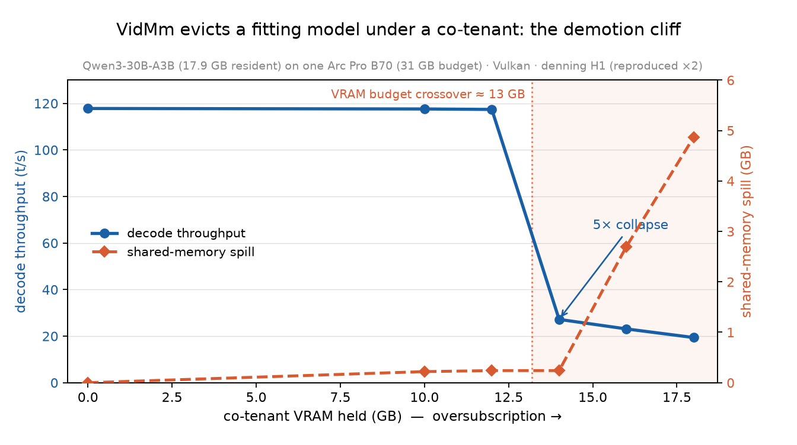
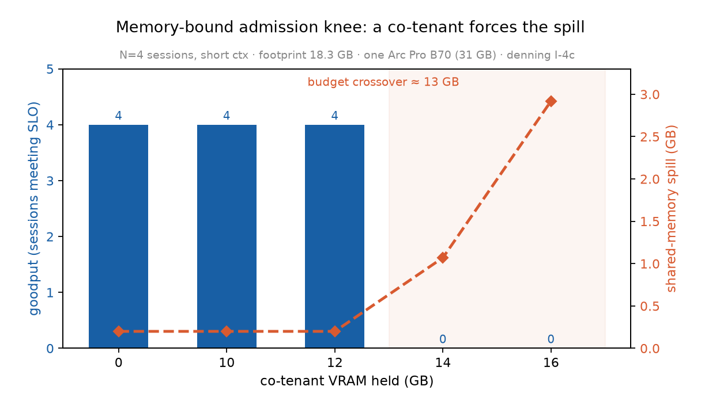
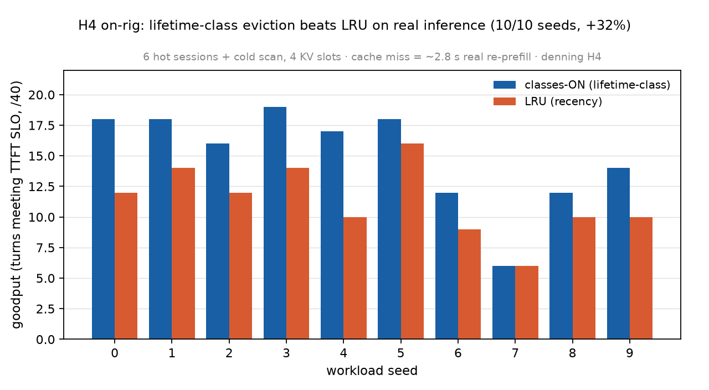
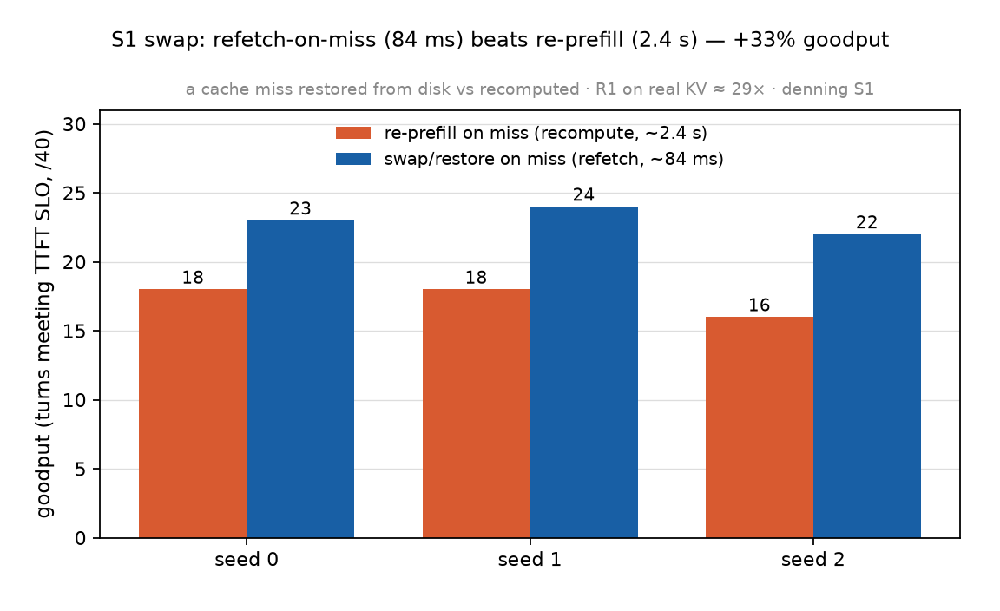

# Co-Residency, Not Pinning: Managing LLM State on Memory-Inverted, OS-Arbitrated GPUs

**denning — HotOS submission draft (2026-06-19).**
*Markdown working draft; ports to the ACM `sigconf` template for submission. Every quantitative prediction in this paper was git-committed before the data that tests it (§7).*

---

## Abstract

The datacenter recipe for large-language-model (LLM) state management — pin the KV cache in HBM, never page it, share it over a fast fabric — **inverts** on the hardware most *local* inference actually runs on: a consumer GPU under a desktop operating system. There, VRAM is virtualized and arbitrated by an adversarial OS memory manager, system RAM is *smaller* than VRAM, and there is no GPU-to-GPU fabric. We show, on dual Intel Arc Pro B70s under Windows, that this inversion is not academic. The OS memory manager (WDDM/VidMm) **involuntarily evicts** a model that fits comfortably in VRAM the moment a co-tenant application appears, collapsing decode throughput **5×**; and the documented residency-priority knob **cannot prevent it**, because it is an intra-process hint, not an inter-process guarantee. We argue the right model is **co-residency**: read the OS's live VRAM budget, admit work beneath it, swap KV cheaply (a refetch is ~29× cheaper than a recompute, on real KV), and order your *own* eviction by reuse-provenance **lifetime class**. We show a closed-form admission rule predicts the eviction cliff exactly, that lifetime-class eviction beats LRU and TTL by 32–365% goodput, and — surprisingly — that once swap is cheap the eviction policy stops mattering. We call for treating the KV cache as an OS-managed resource governed by the live budget signal, not as a pinned datacenter allocation.

---

## 1. Introduction

Almost all LLM-systems research targets one substrate: the datacenter. Data-center GPUs (H100-class) have abundant HBM, a fast fabric (NVLink/InfiniBand), Linux, and — critically — an inference *engine that owns the GPU*. The dominant designs follow from those assumptions: keep the KV cache resident in HBM, page it only into host DRAM as a generous overflow tier [vLLM, LMCache, KVBM], and share it across GPUs over the fabric.

But the fastest-growing deployment surface for LLMs is not the datacenter — it is **local**: a developer's workstation, a prosumer rig, an agent running on the user's own consumer GPU, beside their browser and their games. That substrate violates three load-bearing datacenter assumptions at once:

1. **It is fabric-less.** Consumer cards have no NVLink/Xe-Link, and under Windows there is no GPU peer-to-peer at all.
2. **RAM < VRAM.** A box with two 31 GB cards may have only 32 GB of system RAM — so the host-DRAM offload tier, the datacenter's safety net, is *smaller than the thing it backs*.
3. **The OS owns residency, not the engine.** VRAM is virtualized by the OS memory manager (WDDM/VidMm). The engine shares the card with every other application on the desktop.

This paper makes the case that on this inverted substrate, the datacenter's "pin-everything" model is not merely suboptimal — it is *unavailable* — and that the correct model is **co-residency** with the OS memory manager. Concretely, we contribute:

- **A characterization of the OS as an adversary** (§3): on a real consumer rig, the OS memory manager involuntarily evicts a fitting model under a co-tenant (decode collapses 5×), and **you cannot pin against it** — the documented residency-priority API is intra-process only.
- **A closed-form admission model** on the OS's live VRAM-budget signal (§4) that predicts the eviction cliff exactly (5/5) and the N-session goodput knee.
- **Lifetime-class eviction, measured on live inference** (§4): typed reuse-provenance classes beat LRU by **32%** goodput (and LRU and TTL by **365%** block-grained), and we show **TTL ≡ LRU** under churn.
- **The dominant lever is cheap swap, not policy** (§4): a refetch is ~29× cheaper than a recompute on real KV, and once swap is cheap the eviction policy stops mattering — the cost model's linchpin subsumes the policy question.
- **A pre-registration discipline** (§7): every prediction was git-tagged before its data; a refuted prediction is reported as a success of the method.

We name the system **denning**, for Peter Denning's working-set model [Denning68] — because the right abstraction for LLM state on this substrate is an OS-managed *resident set* admitted to a bandwidth roofline, on a machine where the OS, not the engine, arbitrates residency.

---

## 2. The Inverted Substrate

Our testbed is a representative prosumer box: 2× Intel Arc Pro B70 (Battlemage), each reporting a **31.12 GiB** DXGI budget, **608 GB/s** of bandwidth and ~22.9 TFLOPS FP32 — *bandwidth-rich and FLOP-modest*; **32 GB** of system RAM; PCIe x8; Windows 10; llama.cpp on the Vulkan backend; driver `32.0.101.8826`. Three inversions follow.

**Fabric-less.** Intel states plainly that "Arc does not support GPU-to-GPU connection"; multi-GPU P2P exists only on Linux (Project Battlematrix). On Windows, a card-to-card KV transfer is host-bounced — we measure **0.47×** of a host→VRAM copy. So multi-card serving is replica-per-card, not tensor-parallel-over-fabric; KV does not flow freely between GPUs.

**RAM < VRAM.** The offload tier is *inverted*: 32 GB of host RAM backs 62 GB of VRAM. The datacenter's "spill to abundant DRAM" reflex cascades to NVMe. And the binding host wall is not free RAM but **commit charge** — allocations fail at high commit while physical RAM still reads available.

**OS-arbitrated.** VRAM is virtualized by VidMm. `QueryVideoMemoryInfo` exposes a per-process **`Budget`** that the OS *shrinks under contention*. The engine does not own residency; it negotiates for it, continuously, against the rest of the desktop.

The combination — bandwidth-rich, FLOP-modest, RAM-inverted, OS-arbitrated — **inverts the materialization decision**. In the datacenter one weighs recompute against a fast fabric; here, the scarce resource is the PCIe bus and the adversary is the OS. As we show (§4), the consequence is that *refetching* state over the bus beats *recomputing* it, and that admission control on the live OS budget — not pinning — is the control plane.

---

## 3. The OS Evicts You

> 
> **Figure 1.** A resident, fitting model (17.3 GB on a 31 GB card) decoding at 117 t/s. As a co-tenant holds progressively more VRAM, VidMm involuntarily evicts the model's hot KV/weights to PCIe-bounced shared memory: decode collapses ~5× and the spill climbs linearly with oversubscription. The cliff is sharp, at the VRAM-budget crossover.

**Does the OS actually interfere?** We serve a model that fits comfortably in one card's budget, decoding steadily, and then start a co-tenant VRAM-hog on the same card. VidMm involuntarily demotes part of the *serving process's* KV/weights to host "shared GPU memory" (PCIe-bounced). The effect is severe and reproducible: a model loaded under contention slows **2×**; a **hot, already-resident** model that is then squeezed slows **5×** (decode 117→23 t/s, TTFT 113→911 ms). The shared-memory spill rises ~linearly with oversubscription (0→4.87 GB across the sweep), and the penalty is set by how much of the **hot working set** lands on the wrong side of PCIe — a ~1 GB sliver is enough to halve decode. This is the working-set thrash of 1968, on KV, induced by an OS that does not know it is hosting an inference engine.

**Can you pin against it?** The datacenter answer would be: lock the KV resident. We test the documented Windows mechanism — D3D12 `SetResidencyPriority(MAXIMUM)` + `MakeResident` — with two processes oversubscribing one card, one MAX-priority "arena" and one NORMAL "aggressor." The budgets come back **identical** (15.3 GB each); the MAX-priority process gets *no* larger share and in fact ends up more over-budget. Residency priority is an **intra-process eviction-ordering hint, not an inter-process residency guarantee**, and D3D12 offers no hard pin (no `VirtualLock` analogue for VRAM). **You cannot out-prioritize the OS for residency.**

The two findings together close the datacenter escape hatch. The OS will evict your foreground inference, and you cannot pin against it. The only move left is to *co-reside*.

---

## 4. Co-Residency

If you cannot own residency, you negotiate it. denning's control plane has three measured pieces, all parameterized by a cost model whose constants we measured directly.

### 4.1 Admit beneath the live budget

The OS hands you the limit in real time: when the co-tenant of §3 appears, `QueryVideoMemoryInfo.Budget` drops from 31 to 15 GB within ~8 s. The admission rule is closed-form: with weights `W`, per-session KV `k(ctx)`, and live budget `B`,
`N*(B) = min(compute-concurrency, ⌊(B − W)/k(ctx)⌋)`, and *admit iff footprint ≤ B*.

> 
> **Figure 2.** A co-tenant shrinks the budget; goodput holds at 4/4 until the resident set crosses the budget, then collapses as `non_local` spill appears — b70tools-instrumented. The closed-form rule predicts the crossover.

Fed the live budget, this rule **predicts the eviction cliff 5/5** against the measured hog sweep, and predicts the N-session goodput knee on both its terms — the compute-concurrency limit (`N*≈8` at small context) and the memory limit (where the resident set crosses the budget). `N*` is `min` of the two: at small context the engine's concurrency binds; under a co-tenant or long context the OS budget binds. The OS is not only an adversary — it *tells you* its budget, and co-residency reads that signal.

### 4.2 Order your own eviction by lifetime class

Priority cannot pin against a co-tenant (§3), but it is exactly the right tool for ordering *denning's own* eviction. We tag KV by reuse provenance — `SYSTEM` (shared prefix / tool defs, high reuse), `DOC` (retrieved context), `TURN` (the current turn, no reuse) — and evict low classes first.

> 
> **Figure 3.** On real inference (a router over llama-server KV slots; a cache miss is a real ~2.4 s re-prefill), lifetime-class eviction beats LRU by **+32% goodput-under-SLO** (95% CI [20, 44], 10 reps, classes ≥ LRU on every seed).

On live inference, lifetime classes beat LRU by **+32%** goodput-under-SLO (10 reps, CI [20, 44], 10/10 seeds). Block-grained, against the full baseline set, they beat both LRU and TTL by **+365%** under overload — and **TTL ≡ LRU** at every point, because under churn every block exceeds the TTL window and TTL degenerates to oldest-first. A per-request TTL is therefore *not* a meaningfully different baseline; it inherits recency's provenance-blindness. This is the working-set model applied to KV: protect the reused set, shed the rest.

### 4.3 Swap, don't recompute — and it dominates

> 
> **Figure 4.** Paying a cache miss as a *refetch* (restore the saved KV) instead of a *recompute* (re-prefill it). On real KV: restore = 84 ms, re-prefill = 2422 ms — ~29×. The swap arena gets +33% goodput and −23% latency.

The cost model's linchpin (R1) is that a refetch beats a recompute. We measure it on real KV: restoring a saved 3,507-token KV cache takes **84 ms** while re-prefilling it takes **2,422 ms** — **~29×** (KV is 98 KB/token, measured). And the advantage *grows with context*: restore is bandwidth-bound (~4 GB/s, linear in KV) while re-prefill is superlinear (attention), so the ratio climbs from 22× at 1k tokens to **75× at 14k** — where re-prefilling costs 24.7 s against restore's 0.33 s. Paying a miss as a swap-restore instead of a re-prefill yields **+33%** goodput.

The surprise is what this does to §4.2. **Once swap is cheap, the eviction *policy* stops mattering**: lifetime-class and LRU achieve identical goodput, because a "wrong" eviction is no longer a 2.4 s catastrophe — it is an 84 ms restore. The R1 lever **subsumes** the policy lever. The strategic implication for any system on this substrate: build the cheap swap path *first*; the sophistication of the eviction policy is second-order once misses are cheap.

### 4.4 The cost model (the spine)

denning's design follows from four measured results: **R1**, refetch ≫ recompute (~176× per token in microbench; ~29× end-to-end on real KV); **R2**, compressing KV over the bus wins iff the dequant bandwidth exceeds `B_pcie · r/(r−1)` (it does, 6–8× headroom); **R3**, card→card ≤ ½ host→VRAM; and the admission knee `N* = min(bandwidth, commit, live budget)`. The contribution is not an optimizer but a **feasibility envelope** — the simplest control plane that operates at the bound the OS sets.

---

## 5. Discussion & Open Problems

**Block-grained KV.** Our eviction is sequence-grained because llama.cpp's prefix cache is contiguous — you can keep a prefix or drop a suffix, but not punch a hole. True block-grained co-residency needs paged KV (à la PagedAttention [vLLM]) plus a paged-attention kernel for this stack. Encouragingly, llama.cpp's KV is already *cell-based* — a physical↔logical indirection is half the substrate — so the missing pieces are a host-backed tier and a block table, not a from-scratch rewrite. But §4.3 cautions against over-investing: cheap *sequence-grained* swap already captures most of the win; block-granularity raises the ceiling, not the floor.

**Compression over the bus.** R2 says compress-on-swap should pay; CacheGen [CacheGen] is the direct prior art for KV-as-bitstream. We cost it and defer it as a lever, not a requirement.

**The kernel is a first-class variable.** Performance on this substrate is not portable from CUDA intuition: flash attention is a *pessimization* on Vulkan/Arc (~4× slower at depth), the opposite of CUDA, so quantized KV (which forces flash attention) is a capacity-vs-speed trap here. A correct denning must treat the engine/kernel as a measured parameter.

**Generality.** We measured Intel Arc under Windows/VidMm, but the inversion — RAM<VRAM, OS-arbitrated, fabric-less — characterizes *any* consumer GPU under a desktop OS (NVIDIA/AMD under WDDM included). The MoE architecture is a complementary lever on this substrate: a 3B-active MoE decodes 5.7× faster than a dense 32B of equal size, because decode streams active params and bandwidth is the bottleneck.

---

## 6. The OS as Partner

The framing of §3 is adversarial, and it is — VidMm will knife your inference. But the same interface that evicts you also *reports its budget in real time*. Co-residency is the recognition that the OS memory manager is a co-scheduler you can negotiate with, not an obstacle to route around. denning pushes residency arbitration *down*, to coexist with VidMm, rather than *up*, into a user-space filesystem [Symphony]. The OS already solved working-set management in the 1970s; the task is to speak its language for KV.

---

## 7. On Honesty: Pre-Registration

Systems papers rarely pre-register, but the discipline buys credibility cheaply. Every quantitative prediction in this paper was committed to git and tagged (`prereg-launch-suppositions`) **before** the data that tests it; the commit order is a tamper-evident integrity proof. A refuted prediction is reported as a *success of the method*: we predicted, for instance, that quantizing the KV cache would push the long-context decode cliff *out*; the data showed the opposite (q8 KV forces the poorly-optimized Vulkan flash-attention path), and we report the correction rather than burying it. The git history *is* the methods section.

---

## 8. Related Work

**KV paging and tiering.** vLLM's PagedAttention [vLLM] is the OS-paging-for-KV baseline; vAttention [vAttention] is the counter-trend (remove software paging via hardware VM). LMCache, SGLang HiCache, and NVIDIA Dynamo's **KVBM** build engine-independent tiered KV with priority+TTL eviction. KVBM is the closest incumbent — but it assumes the engine owns HBM and a fast fabric on CUDA/Linux. denning operates precisely where those assumptions fail: the OS (VidMm) arbitrates residency, RAM<VRAM, the fabric is absent — and it adds a *closed-form* admission controller on the live OS budget, not a heuristic tier policy. **Continuum/CacheTTL** [ICLR'26 workshop] ships per-request KV TTL on vLLM; we show (§4.2) that TTL collapses to LRU under churn, and we add lifetime *classes* and admission. **kvcached** offers elastic GPU virtual memory on CUDA — an orthogonal mechanism.

**OS-for-KV framing.** **Symphony** [HotOS'25; SOSP'25] proposes a syscall/filesystem interface for KV, pushing management *up* to the user program. denning is the inverse: it pushes residency arbitration *down* to coexist with the existing OS memory manager. PTask [PTask, SOSP'11] is the 15-year-old "OS abstractions for GPUs" ancestor.

**Compression and MoE.** CacheGen [CacheGen, SIGCOMM'24] compresses KV into bitstreams for fast transfer — the direct prior art for our R2 arm. KTransformers [SOSP'25] and FluxMoE run frontier MoE on one consumer GPU via expert offload; FluxMoE *decouples* expert residency, the clean counter-position to our *unify*.

**Foundations.** Denning's working-set model [Denning68] and the page-fault-frequency load-control tradition that followed [Denning80] are the intellectual lineage; Bélády's MIN is the optimal-eviction reference; regions and generational GC are prior art for lifetime classes.

**One-line delta.** Prior KV-management work assumes the engine owns the GPU on CUDA/Linux with a fabric. denning is the first to treat residency as *co-managed with an adversarial desktop OS memory manager*, on a memory-inverted, fabric-less consumer GPU, governed by a closed-form admission controller on the live OS budget signal.

---

## 9. Conclusion

The datacenter answer to LLM-state management inverts on the hardware most local inference runs on. We measured, on a real consumer rig, that the OS memory manager will involuntarily evict your inference (5× decode collapse) and that you cannot pin against it. The alternative is co-residency: admit beneath the OS's live budget, swap KV cheaply (refetch ≫ recompute), and order your own eviction by lifetime class — with the swap lever, not the policy, doing most of the work. Treat the KV cache as an OS-managed resource governed by the live budget signal. The next problem is paged KV for block-grained co-residency; the substrate is already half-built for it.

---

## References

- **[Denning68]** P. J. Denning. The Working Set Model for Program Behavior. *CACM* 11(5), 1968.
- **[Denning80]** P. J. Denning. Working Sets Past and Present. *IEEE TSE*, 1980. (PFF load control: Chu & Opderbeck, 1972.)
- **[vLLM]** Kwon et al. Efficient Memory Management for LLM Serving with PagedAttention. *SOSP* 2023.
- **[vAttention]** Prabhu et al. vAttention: Dynamic Memory Management for Serving LLMs without PagedAttention. *ASPLOS* 2025.
- **[Symphony]** Symphony: a syscall/KVFS interface for KV. *HotOS* 2025 (and SOSP 2025 follow-up).
- **[KVBM]** NVIDIA Dynamo KV Block Manager — engine-independent tiered KV with priority+TTL.
- **[CacheGen]** Liu et al. CacheGen: KV Cache Compression and Streaming for Fast LLM Serving. *SIGCOMM* 2024.
- **[ICLR'26 workshop]** Continuum / CacheTTL: per-request KV TTL pinning. Lifelong Agent Workshop @ ICLR 2026.
- **[KTransformers]** *SOSP* 2025. — frontier MoE on one consumer GPU + CPU/NVMe offload.
- **[FluxMoE]** PagedTensor expert-residency decoupling, 2026.
- **[PTask]** Rossbach et al. PTask: Operating System Abstractions to Manage GPUs as Compute Devices. *SOSP* 2011.
- LMCache; SGLang HiCache; kvcached; Bélády MIN; AdaptSize (*NSDI* 2017); Segcache (*NSDI* 2021).
- WDDM/VidMm, `IDXGIAdapter3::QueryVideoMemoryInfo`, D3D12 `SetResidencyPriority`/`MakeResident` — Microsoft documentation.

---

*Artifact: every result in this paper is reproduced by scripts in the [denning repository](https://github.com/djcdevelopment/denning); figures regenerate from measured constants via `figures/make_figures.py`; predictions are git-tagged `prereg-launch-suppositions`.*
