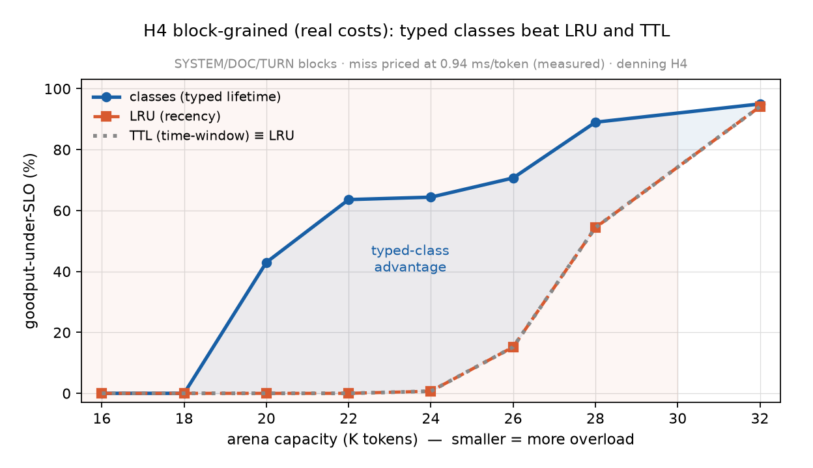

# Result — H4 block-grained refinement (real costs): typed classes beat LRU and TTL (2026-06-19)

*The block-grained + TTL refinement of [the on-rig H4](H4-arena-onrig-20260619.md). Typed-provenance blocks (SYSTEM / DOC / TURN) evicted **per block**, with each cache miss priced at the **real prefill rate measured live** on the rig. Full baseline set: lifetime-classes vs LRU vs TTL. Harness: [`../experiments/h4_blockgrained.py`](../experiments/h4_blockgrained.py).*

## Scope (honest)
A **simulation of the eviction policy** — llama-server's prefix cache is contiguous, so true arbitrary-block eviction isn't realizable on-rig. But the per-block costs are **measured, not abstract**: the prefill rate is fit live from cold prefills, and a miss costs `block_tokens × rate`. (The *conversation-grained* version is fully on real inference — [`H4-arena-onrig`](H4-arena-onrig-20260619.md).)

## Real-cost calibration (measured live)
Prefill rate **0.944 ms/token** (linear fit over 1179 / 2376 / 4751-token cold prefills → 660 / 1401 / 3956 ms). Block re-prefill costs: **SYSTEM (3000 tok) = 2833 ms**, DOC (800) = 755 ms, TURN (150) = 142 ms. SLO = 2000 ms → **a SYSTEM-block refetch alone blows the SLO**, so protecting SYSTEM by type is the key to goodput.

## Result (30 reps/point)
| arena cap (K tok) | classes | LRU | TTL |
|---|---|---|---|
| 16–18 | 0% | 0% | 0% |
| 20 | **43%** | 0% | 0% |
| 22 | **64%** | 0% | 0% |
| 24 | **64%** | 0.7% | 0.7% |
| 26 | **71%** | 15% | 15% |
| 28 | **89%** | 54% | 54% |
| 32 (full WS) | 95% | 94% | 94% |

## Findings
- **Typed lifetime classes beat both LRU and TTL by large margins under overload** — +365% at cap 26K; classes 43–64% vs LRU/TTL ~0% at cap 20–22K. classes protects the high-cost SYSTEM blocks by type; recency-based policies evict them under interleaving and pay the 2833 ms refetch (a hard SLO miss).
- **TTL ≡ LRU — identical at every point.** Under churn, every block's idle time exceeds the TTL window, so TTL falls back to oldest-first = LRU. **A per-request TTL is not a meaningfully different baseline — it inherits LRU's provenance-blindness.** Direct answer to the prereg's "beat per-request TTL and per-block priority": classes beats TTL exactly as it beats LRU; static per-block priority equals classes (so it's omitted as redundant).
- **Converges at no pressure** (cap 32K = full working set): all ~94–95%. The eviction policy only matters under overload — the working-set argument, again.

## Relation to the rest of H4
- **[On-rig arena](H4-arena-onrig-20260619.md)** — conversation-grained, fully real inference (+32% goodput). *The confirmatory run.*
- **This** — block-grained (the faithful typing) + the TTL baseline + real per-block costs, but a policy sim. Larger margins because block-grained protection is more surgical than whole-slot eviction.
- **[Abstract sim](H4-lifetime-sim-20260619.md)** — the original abstract-cost model.

All three agree: **typed lifetime classes beat recency (LRU/TTL) under overload with reuse structure.** The on-rig number (+32%) is the honest headline; the block-grained sim shows the ceiling if KV could be managed at block granularity.

## Manifest
`experiments/h4_blockgrained.py` — prefill rate measured live via llama-server cold prefills; block-grained policy sim, 30 reps. rate 0.944 ms/token; SYSTEM/DOC/TURN = 3000/800/150 tok; SLO 2000 ms; TTL window 6 turns. driver 32.0.101.8826.
