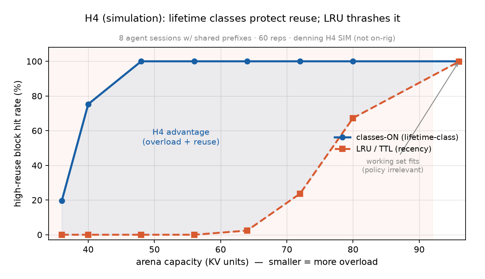

# Result — H4 (SIMULATION): typed lifetime classes vs LRU/TTL eviction (2026-06-19)

> ⚠️ **EXPLORATORY SIMULATION — not the on-rig confirmatory H4.** The tagged H4 prediction is about on-rig goodput, which needs denning's own KV arena (operator-gated). After I-3 the arena became *"admit beneath the live budget + order your own eviction by lifetime class"* — and this sim tests the **eviction-ordering half** of that policy in isolation. Clearly labelled exploratory; it motivates, it does not replace, the tagged confirmatory run.

*Does a typed lifetime-class eviction policy (protect high-reuse provenance) beat a recency baseline (LRU/TTL) under overload? Harness: [`../experiments/h4_lifetime_sim.py`](../experiments/h4_lifetime_sim.py) — a pure-Python trace simulation, 60 reps/point.*

## Setup
8 agent sessions × 25 turns. Lifetime classes by reuse provenance:
- **SYSTEM** (system prompt / tool defs / shared prefix) — size 4, referenced *every* turn (high reuse).
- **DOC** (retrieved context) — size 2, intermittent.
- **TURN** (the current turn's tokens) — size 1, used once.

`classes-ON` evicts TURN → DOC → SYSTEM (protect reuse); `LRU/TTL` evicts by recency only. Arena capacity swept across the overload spectrum (full working set ≈ 96 units; SYSTEM floor 32). **Metric:** the high-reuse SYSTEM-block hit rate = session-turns served *without* the SLO-violating refetch of the big reused block (R1: refetch ≫ recompute).

## Result
| arena cap | classes-ON | LRU/TTL | gain (95% CI) |
|---|---|---|---|
| 36 (deep overload) | 19.5% | 0.0% | +19.5 pp ± 0.8 |
| 40 | 75.3% | 0.0% | +75.3 pp |
| 48 | 100% | 0.0% | +100 pp |
| 56 | 100% | 0.0% | +100 pp |
| 64 | 100% | 2.4% | +97.6 pp |
| 72 | 100% | 23.7% | +76.3 pp |
| 80 | 100% | 67.3% | +32.7 pp (+46% rel) |
| 96 (no overload) | 100% | 99.8% | +0.2 pp |

## Reading
- **Across the entire overload regime, lifetime classes beat LRU/TTL by far more than the pre-registered ≥20% bar** — +32 to +100 percentage points. classes-ON keeps the reused SYSTEM block ~100% resident as soon as it fits (cap ≥ 48); LRU evicts it by recency under cross-session interleaving and only recovers as capacity approaches the full working set.
- **The advantage appears exactly where it should and vanishes where it should:** ≈0 at cap 96 (no pressure → eviction policy is irrelevant), maximal under overload. This *is* the working-set argument — fitting for a project named after Denning.
- **Mechanism:** recency (LRU/TTL) is provenance-blind — it evicts a high-reuse shared prefix that's about to be reused; lifetime classes encode "this block is reused, protect it." A refetch of that block is the long stall, so protecting it *is* goodput-under-SLO. Pairs with the I-3 finding: priority can't pin against a *co-tenant*, but it's exactly the right tool for ordering denning's *own* eviction.

## Caveats (honest — this is a SIM)
- **Not the tagged on-rig H4.** Real KV sizes, real refetch/recompute costs, real SLO timing, and the denning arena managing llama's KV are the confirmatory version — operator-gated, needs the arena build.
- **The magnitude is partly structural:** classes-ON protects SYSTEM by construction, so the win is large *whenever* the workload has high-reuse structure + overload. That assumption (agent workloads have high-reuse shared prefixes — system prompts, tool defs, RAG context) is realistic but *is* an assumption.
- LRU stands in for the recency family (TTL/LRU); a tuned TTL differs in detail but shares the provenance-blindness.

## Verdict
Directionally **strong support for H4 in simulation**: typed lifetime classes beat recency eviction by ≥20 pp across the overload regime when reuse-provenance structure exists. The on-rig confirmatory run (the arena) is the next operator-gated step.

## Manifest
`experiments/h4_lifetime_sim.py` (pure-Python trace sim, 60 reps). Constants: N=8, T=25, 4 docs/session, sizes SYSTEM=4 / DOC=2 / TURN=1.
