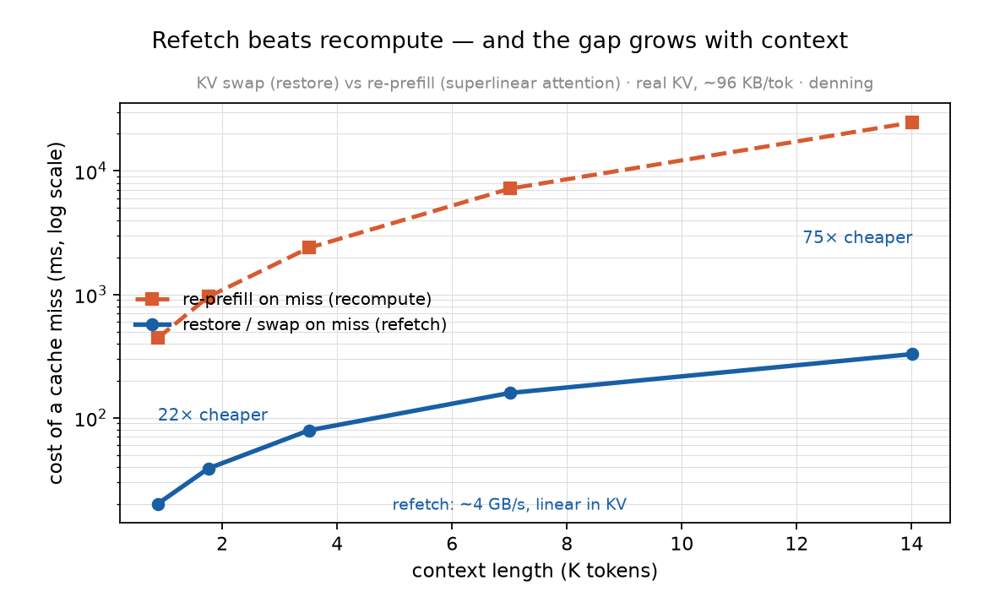

# Result — Swap-cost curve: refetch's advantage GROWS with context (2026-06-19)

*Characterizes the [S1](S1-swap-arena-20260619.md) swap lever across KV size: cold-prefill (recompute) vs save+restore (refetch), swept over context. Harness: [`../experiments/h4_swap_sweep.py`](../experiments/h4_swap_sweep.py).*

| context (tok) | re-prefill — recompute (ms) | restore — refetch (ms) | KV (GB) | restore (GB/s) | R1 (recompute / refetch) |
|---|---|---|---|---|---|
| 877 | 442 | 20.1 | 0.080 | 4.0 | **22×** |
| 1759 | 957 | 38.9 | 0.161 | 4.1 | 25× |
| 3509 | 2383 | 79.1 | 0.321 | 4.1 | 30× |
| 7009 | 7190 | 159 | 0.642 | 4.0 | 45× |
| 14010 | 24718 | 328 | 1.283 | 3.9 | **75×** |

## Findings
- **Restore (refetch) is bandwidth-bound at a constant ~4.0 GB/s** → linear in KV size. KV ≈ **96–98 KB/token**, consistent across the sweep.
- **Re-prefill (recompute) is superlinear in context** (the attention cost): 0.5 ms/tok at 877 → 1.76 ms/tok at 14k.
- **So the swap advantage grows with context: 22× at ~1k → 75× at ~14k.** Long-context agents — exactly where the KV is expensive — benefit most from swapping.
- **The absolute stakes are stark:** re-prefilling a 14k context = **24.7 seconds**; restoring it = **0.33 s**. For any interactive agent, recompute-on-miss is a catastrophic stall; swap-on-miss is sub-second.
- The ~4 GB/s restore is *below* the PCIe bound (13.9 GB/s) — the file save/restore path has serialization overhead. A host-RAM tier / direct DMA (no file) could push toward the bus bound and widen R1 further (the S2 / host-tier lever).

## Implication
Strengthens R1 / the swap lever: refetch ≫ recompute is not just true, it **intensifies with context**. Combined with S1's finding that cheap swap subsumes the eviction policy, the design priority is unambiguous — the swap path is the dominant lever, and it is most valuable at the long contexts agents actually run.

## Manifest
`experiments/h4_swap_sweep.py` (`llama-server --slot-save-path`; cold-prefill vs save/restore, ctx 1k–16k). Card B Vulkan. restore ~4 GB/s; `k` ≈ 96–98 KB/tok. driver 32.0.101.8826.
