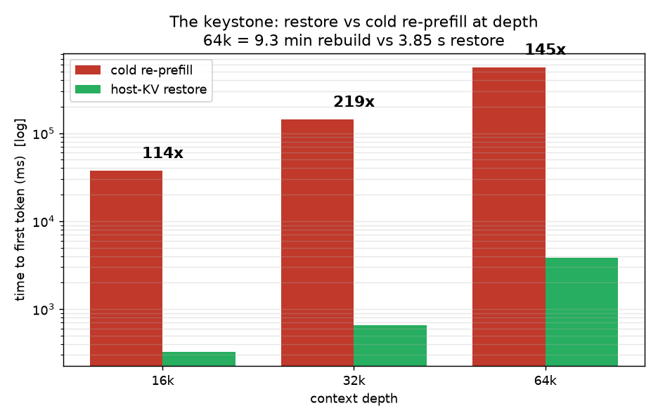
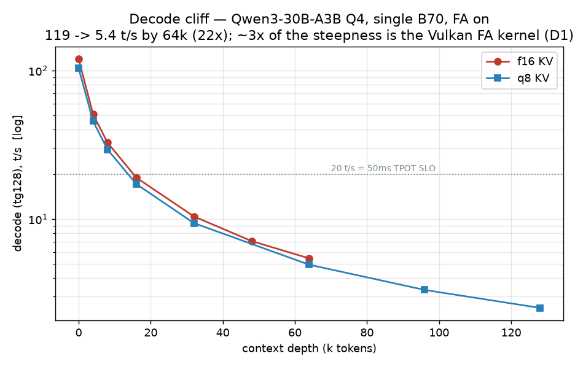
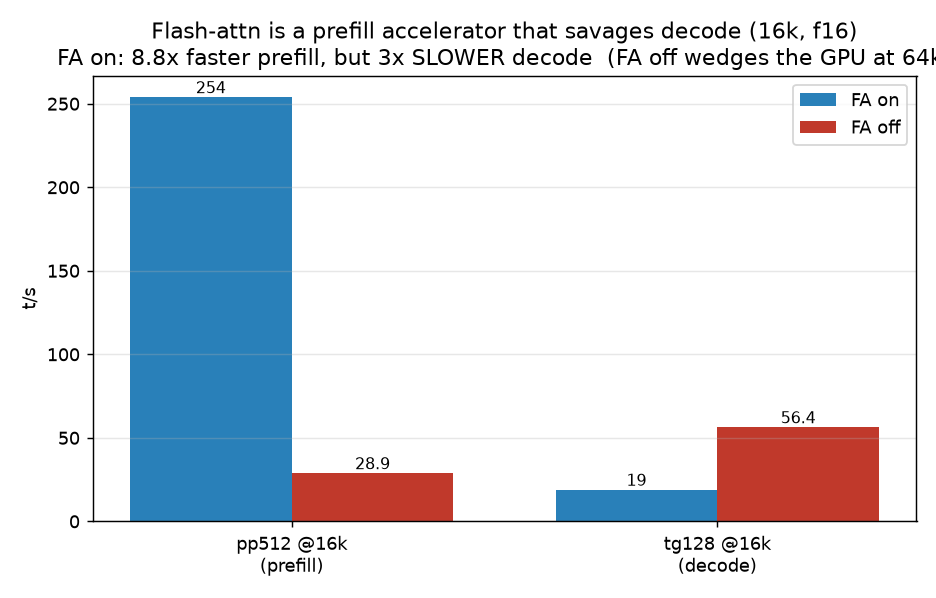
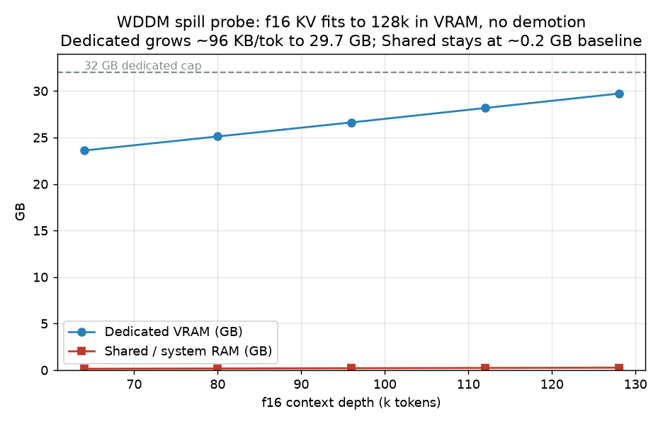

# Result — thermal-window regression battery (2026-06-21)

*A single cool-morning batch run autonomously on the dual-B70 rig: per-card noise
floor, KV-size scaling (decode cliff + capacity), the restore-vs-re-prefill keystone,
flash-attn on/off at depth, a WDDM spill probe, and the dual-card A/B. Pre-registered
in [`../prereg/battery-thermal-20260621.md`](../prereg/battery-thermal-20260621.md)
(git tag `prereg-battery-20260621`) **before** any data. Raw artifacts:
`results/raw/battery-*`.*

## Disclosure / RIG
- **GPUs:** 2× Intel Arc Pro B70 32GB, headless (Vulkan **1,2**) + RTX 2070 Super display (Vulkan **0**, never served). **ECC off** (full 32GB usable — load-bearing for the capacity numbers).
- **Host:** Ryzen 9 5900X / X570 AORUS Ultra / **32GB DDR4-3800 1:1** (FCLK 1900) 16-19-19-39.
- **PCIe:** B70s nominally x8/x8 PCIe 4.0 (slot 3 / 2070 is chipset x4, separate domain). Idle PnP link-width reads are cached (x1) and unreliable; live width needs an IGCL probe (deferred). Not a measured bottleneck in this battery.
- **Engine:** llama.cpp Vulkan **b9279** (47c0eda9d). **Arc driver 32.0.101.8826.** Windows 10.
- **Model:** Qwen3-30B-A3B-Instruct-2507-Q4_K_M (17.3 GiB). **Measured f16 KV ≈ 96 KB/token** (q8 ≈ 48 KB/tok).
- Device pinning via `GGML_VK_VISIBLE_DEVICES`; device 0 hidden from every process.

## Pre-registered predictions → outcomes
| # | prediction | outcome |
|---|---|---|
| **P1** | decode cliff: tg@64k ≤ ⅓ of tg@0 | **CONFIRMED** — 22× drop (far steeper) |
| **P2** | prefill degrades less steeply than decode | **CONFIRMED** — prefill stays ~13× faster than decode at every depth |
| **P3** | q8 reaches 125k; f16 OOMs before ~72k | **REFUTED** — f16 reaches **128k in VRAM** (no spill); ceiling ~150k. Capacity isn't the single-stream limit |
| **P4** | q8 decode within ~15% of f16 | **CONFIRMED** — ~10% slower, flat across depth |
| **P5** | the two B70s within ±5% | **CONFIRMED** — 0.3% (decode) / 3.2% (prefill) |

*Two refuted/over-claimed calls were corrected by measurement mid-run (P3; an earlier "f16 can't reach 96k" assertion). A spill hypothesis (was the f16 "fit" a silent WDDM demotion?) was tested and refuted. Method working in both directions.*

## A — per-card noise floor (f16, FA on, r=5)
| card | pp512 (t/s) | tg128 (t/s) |
|---|---|---|
| B70 #1 | 2016.6 ± 12.2 | 119.41 ± 0.06 |
| B70 #2 | 2080.8 ± 47.0 | 119.81 ± 0.13 |

Matched pair (P5). Sub-0.2% variance → clean instrument / noise floor.

## B — KV-size scaling: the decode cliff + capacity (single card, FA on, r=5)
**Decode (tg128 t/s) vs depth:**
| depth | f16 | q8 | q8 vs f16 |
|---|---|---|---|
| 0 | 119.6 | 103.7 | −13% |
| 16k | 19.0 | 17.2 | −10% |
| 32k | 10.4 | 9.38 | −10% |
| 64k | **5.43** | 4.92 | −9% |
| 96k | (OOM-free, see spill) | 3.33 | — |
| 128k | — | **2.52** | — |

**Prefill (pp512 t/s):** f16 2014 → 69.6 (0→64k); q8 1970 → 31.2 (0→128k).

- **Decode cliff (P1):** 22× (f16, 0→64k), 41× (q8, 0→128k). Per-token attention cost is linear in depth (8.4 ms/tok → 184 ms/tok at 64k); a 128-token reply at 64k takes 23.6 s. A *kernel* property — motivation, not a denning win.
- **q8 (P4):** flat ~10% decode penalty for half the KV bytes → ~2× the concurrent/swapped sessions at a depth.

## C1 — restore vs cold re-prefill: the keystone (single card, q8, n=1/depth)
| depth | cold re-prefill TTFT | restore (total) | speedup |
|---|---|---|---|
| 16k | 37.2 s | 0.33 s | **114×** |
| 32k | 142.8 s | 0.65 s | **219×** |
| 64k | **558.9 s (9.3 min)** | 3.85 s | **145×** |

At 64k, rebuilding an evicted KV costs **9.3 minutes**; restoring it costs **< 4 s**. The cost-model floor was ~29×; measured is 100–200×+ because cold re-prefill *explodes* with depth while restore stays sub-(few)-seconds. *Caveat: runs were concurrent with other rows, so restore-side numbers are likely slightly inflated (conservative); 64k's dip vs 32k is that inflation.*

## D1 — flash-attn on/off at depth (single card, f16)
| depth | metric | FA-on | FA-off |
|---|---|---|---|
| 0 | pp512 / tg128 | 2014 / 119.6 | 2160 / 131.9 |
| 16k | pp512 | 254 | **28.9** |
| 16k | tg128 | **19.0** | **56.4** |
| 64k | both | 69.6 / 5.43 | **HUNG (GPU wedge)** |

**Flash-attn on Vulkan/Arc is a prefill accelerator that savages decode:** at 16k, FA-on prefill is 8.8× faster but FA-on decode is **3× slower** than FA-off. So the decode cliff is **~3× self-inflicted by the kernel** — a CUDA-grade FlashAttention would plausibly put decode@64k near ~15 t/s, not 5.4. **But FA-off is not an escape:** its prefill is catastrophic (28.9 t/s) and it **wedged the GPU outright at 64k** (killed; driver recovered cleanly). Conclusion: forced into FA-on, eat the 3× decode tax → the case for the SYCL/IPEX path (where the *cliff*, not residency, gets fixed).

## Spill probe — does WDDM silently demote f16 KV to system RAM? (single card, f16)
| depth | Dedicated VRAM | Shared (sys RAM) |
|---|---|---|
| 64k | 23.6 GB | 0.14 GB |
| 96k | 26.6 GB | 0.20 GB |
| 128k | **29.7 GB** | **0.26 GB** |

**No spill** up to 128k — dedicated grows linearly (~96 KB/tok) and tops at 29.7 GB, under the 32 GB cap; shared never lifts off baseline. So f16 genuinely *fits* (P3 refuted, not an artifact), and **every single-stream number above is spill-free.** WDDM demotion is real but triggers only past 32 GB dedicated — i.e. under **concurrency / co-tenant** (denning's regime), not single-stream ≤128k.

## E1 — dual-card A/B (16 concurrent, f16, 2k ctx)
| metric | baseline | denning |
|---|---|---|
| goodput | 16/16 | 16/16 |
| TTFT p99 | 517 ms | 330 ms |
| TPOT p99 | 31.3 ms | 30.1 ms |
| output | 489 t/s | 508 t/s |
| TDR | clean | clean |

**No-op under no pressure** (both 16/16 — the integrity claim) with a slight denning edge from routing, never a penalty. Reproduces the prior A/B to the millisecond. Both arms **TDR-clean after** the D1 wedge → dual-card driver stability confirmed. (denning's admission *win* — shed-vs-queue — is the single-card-oversubscribed case, on record elsewhere.)

## Perplexity — q8-KV quality cost (wikitext-2, 4096 ctx, 40 chunks, FA on)
| KV | PPL |
|---|---|
| f16 | 6.2470 ± 0.0551 |
| q8 | 6.2443 ± 0.0551 |

q8-KV is **statistically identical** to f16-KV (Δ = 0.0027 = **0.04%**, far inside the ±0.9% error bars) — **no measurable quality cost.** Combined with B (~10% decode penalty) and the spill probe (half the bytes → ~2× capacity): **q8 KV is a near-free concurrency/swap win — ~10% speed for 2× the sessions at zero quality loss.** The "just quantize the cache" question, settled affirmatively.

## Figures

Regenerate: [`../experiments/make_battery_charts.py`](../experiments/make_battery_charts.py).

## Cross-cutting conclusions
1. **The decode cliff is real (22–41×) and ~3× kernel-self-inflicted** (Vulkan FA penalty). It's motivation, not a denning win; the fix is better kernels (SYCL/IPEX), not a control plane.
2. **Restore ≫ re-prefill at depth (114–219×; 9 min vs 4 s at 64k)** — the keystone. On Windows, "the OS reclaimed your budget, just re-prefill" = a multi-minute stall; residency management is the difference between interactive and unusable.
3. **The single-stream binding limit is the cliff, not VRAM** — both KV types fit 128k+; capacity is a concurrency/swap question, not a depth one.
4. **The system binding limit is host RAM (32GB)** — observed live: host hit 91% (commit WARN) during a 64k KV swap while VRAM had headroom. The memory inversion, rendered. Caps the swap tier (~2 swapped 64k sessions).
5. **denning is a no-op under no pressure and earns its keep under oversubscription/co-tenant** — the exact regime where eviction/spill bites.

## Operational notes / incidents
- **D1 FA-off-64k wedged the GPU** (0% compute, CPU busy-wait); killed cleanly, driver recovered (clean spill test + E1 confirm). FA-off is non-viable at depth on this stack.
- **Host commit hit 88.5% WARN** during the C1-64k swap + concurrency; transient, fully recovered on completion. Pagefile grew ~20 GB on C: then released.
- Watchdog recalibrated this run: phys floor 30/31/31.6 GB (a resident 17 GB model legitimately sits ~28 GB; commit % is the binding signal per finding A4); C: floor 65/20 GB (operator rule); `--watch-tdr` armed for the dual-card block. No SAFE/ABORT fired except the pre-recalibration false-positives.
