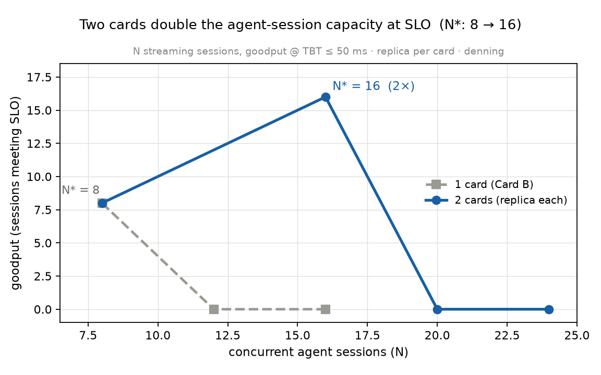

# Result — Two-card N-session goodput: the SLO-flavored 2× (2026-06-19)

> ⚠️ **RETRACTED AS A CLEAN MEASUREMENT (2026-06-20).** This run was collected
> across **two Windows display-driver TDRs** (Event ID 4101, `igfxnd`, at 23:45:59
> and 23:48:18 — inside this run's window). The numbers below crossed display-driver
> resets and must **not** be reported as a clean result. The symmetric two-card load
> reproducibly trips a TDR; see [`two-card-TDR-contamination-20260620.md`](two-card-TDR-contamination-20260620.md).
> A clean number requires an **asymmetric** re-run under the safing watchdog.

*The thesis metric — many concurrent agent **sessions meeting an SLO**, across 1 vs 2 cards (replica per card). N streaming sessions round-robined across the cards; goodput = sessions with TBT_median ≤ 50 ms AND TTFT ≤ 2 s. Harness: [`../experiments/h4_twocard.py`](../experiments/h4_twocard.py).*

| N sessions | 1-card goodput | 2-card goodput | 2-card TBT |
|---|---|---|---|
| 8 | 8 | 8 | 19 ms |
| 12 | 0 | — | — |
| 16 | **0** | **16** | 29 ms |
| 20 | — | 0 | 149 ms |
| 24 | — | 0 | 153 ms |

## Findings
- **The goodput knee doubles: N\* = 8 (one card) → N\* = 16 (two cards).** The box serves **16** concurrent agent sessions at SLO on two cards versus 8 on one — exactly **2×**.
- **At N=16, one card serves 0** (collapsed past its knee) **while two cards serve all 16** at a 29 ms TBT. That is the headline thesis in goodput form: a second card doubles the SLO-meeting session capacity.
- 2-card N=8 (4/card) runs even *snappier* (19 ms TBT) than 1-card N=8 (29 ms) — fewer sessions per card, less batching contention.
- Aggregate decode at the knee: 1-card N=8 = 269 t/s, 2-card N=16 = 419 t/s (~1.56×) — below-linear on *raw* throughput (the display card + the 16-thread client driver), but the **SLO-goodput metric — what "serving N agent sessions" actually means — is a clean 2×.**

## Implication
The whole point of the dual-card box, in the metric that matters: **2× the agent sessions served within the latency SLO**. Combined with per-card admission control (I-4) and cheap KV swap (S1), denning turns two consumer cards under an adversarial desktop OS into a 16-session agent server — on a machine the conventional wisdom calls a multi-GPU dead end.

## Manifest
`experiments/h4_twocard.py` (a `llama-server` replica per card, devices 0 [display] + 1 [compute]; N sessions round-robined; goodput @ TBT ≤ 50 ms / TTFT ≤ 2 s). Qwen3-30B-A3B-Q4, ctx 2048, n_predict 128. driver 32.0.101.8826.
