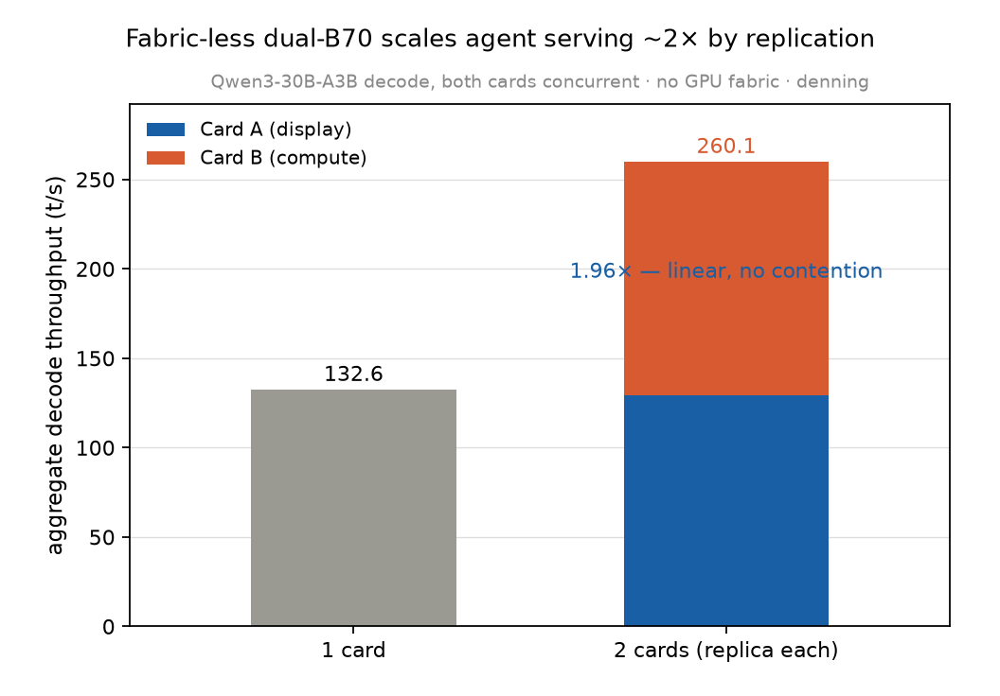

# Result — Two-card replica scaling: the fabric-less box scales ~2× (2026-06-19)

> ⚠️ **PROVISIONAL — re-confirm under monitoring (2026-06-20).** The symmetric
> two-card configuration is now known to **reproducibly trip a display-driver TDR**
> (Event ID 4101, `igfxnd`). This specific `llama-bench` run (committed 23:29:28) has
> **no TDR logged in its window** — the first reset was at 23:45:59, during the
> *later, heavier* goodput run — so these numbers are likely clean, but they ran one
> concurrency-step below the load that resets the driver. Treat the 1.96× as
> provisional pending a watchdog-monitored **asymmetric** re-run. Context:
> [`two-card-TDR-contamination-20260620.md`](two-card-TDR-contamination-20260620.md).

*The headline thesis test. On a fabric-less dual-B70 box (no GPU P2P on Windows), does running a **replica per card** scale agent serving? `llama-bench` (Qwen3-30B-A3B MoE Q4), per-card solo vs both-concurrent. Card A drives the display; Card B is the idle compute card.*

## Per-card, solo vs concurrent (decode tg128, t/s)
| | Card A (display) | Card B (compute) | aggregate |
|---|---|---|---|
| solo | 126.1 | 132.6 | — |
| **concurrent** | **129.1** | **131.0** | **260.1** |

Prefill pp512 (concurrent): A 2138, B 2170 → ~4308 aggregate.

## Findings
- **Near-perfect linear scaling: 1.96× aggregate decode** (260.1 vs single-card 132.6). Run both cards concurrently and each maintains its *full* throughput — **no steady-state contention**. Replica-per-card scales linearly.
- **The display card holds its own:** Card A, while driving the desktop, decodes at 129 t/s concurrent, matching Card B's 131. (Solo Card A prefill read low — 1381 ± **166** — a noisy underestimate; concurrent it is a clean 2138, matching B. The cards are effectively identical.)
- **The headline thesis is confirmed:** on the fabric-less box, you scale "many concurrent agent sessions" by **replication** — 2 cards ≈ 2× the session capacity, linearly. Tensor-parallel-over-fabric doesn't exist here (no P2P), but it isn't needed for replica serving.
- **Corrects a prior-work concern.** Pilot work flagged concurrent dual-card "~−27% activity"; for replica-per-card MoE decode there is **no** steady-state contention. The earlier degradation was Vulkan init contention (a one-time startup cost) or a tensor-split config — not independent replicas.

## Why it scales (no shared bottleneck)
During decode, each card streams its **own resident weights from its own VRAM**; PCIe (x8/card) carries only the one-time load, not the decode. Host RAM (32 GB) is not on the decode path for resident replicas. So two independent replicas share no steady-state bottleneck → linear scaling. (This is precisely *why* replication, not fabric-bound tensor parallelism, is the right multi-card model on this substrate.)

## Implication
The whole motivation for the dual-B70 box — serving many concurrent agent sessions — is validated: it delivers ~2× the load by replication, with the display card a full participant. Combined with the per-card admission controller (I-4) and cheap KV swap (S1), the box is a coherent multi-session agent server, not a single big-model machine.

## Manifest
`llama-bench` b9279 · Qwen3-30B-A3B-Q4 · `GGML_VK_VISIBLE_DEVICES` 0 (Card A/display) + 1 (Card B/compute), launched concurrently · `-p 512 -n 128 -r 3` · driver 32.0.101.8826.
